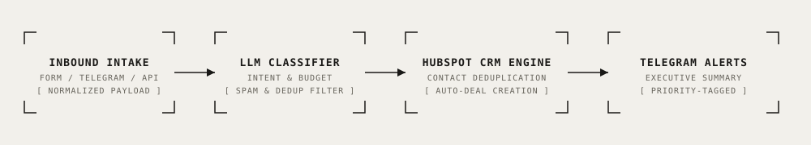

# Automated CRM Lead Qualification & HubSpot Sync

<div align="center">

[](https://www.python.org/)
[](https://fastapi.tiangolo.com/)
[](https://developers.hubspot.com/)
[](https://docs.pydantic.dev/)
[](https://openai.com/)
[](./LICENSE)
[](#lead-qualification-benchmark)

**Production inbound lead qualification service that analyzes incoming inquiries, extracts budget and urgency metadata without hallucination, deduplicates contacts in HubSpot CRM, filters spam, and dispatches executive Telegram alerts.**

[Key Features](#key-features) • [Architecture](#architecture) • [Engineering Decisions](#key-engineering-decisions) • [Quick Start](#quick-start) • [Benchmark](#lead-qualification-benchmark) • [Telemetry & Cost](#telemetry--operational-cost)

</div>

---

## Overview

In sales operations, routing raw inbound messages directly to account executives results in bloated CRMs, wasted sales rep hours on unqualified prospects, and missed enterprise opportunities.

This repository provides an automated lead qualification engine that sits between customer touchpoints (web forms, chat widgets, Telegram bots) and CRM systems (HubSpot / Salesforce):
1. Ingests and normalizes lead payloads.
2. Extracts commercial parameters: intent classification, priority tiers (`high`, `medium`, `low`), explicit budget figures, and delivery urgency.
3. Enforces anti-hallucination: missing budgets remain `null` rather than guessing numbers.
4. Performs email-based deduplication in CRM before creating deals.
5. Filters spam and non-lead noise, suppressing empty deal creation.
6. Emits structured Telegram alerts with direct CRM links to sales leadership.

---

## Architecture

<p align="center">
  
</p>

```
[Web Form / Telegram / API]
             │
             ▼
     [src/lead_intake.py]
     - Email Normalization & Phone Formatting
     - Length & Format Validation
             │
             ▼
      [src/classify.py]
      - LLM Intent & Urgency Classifier
      - Strict Anti-Hallucination Regex Guardrail on Budgets
      - Spam & Job Applicant Filter (`should_create_deal=False`)
             │
             ▼
     [src/crm_client.py]
     - HubSpot Search (`POST /crm/v3/objects/contacts/search`)
     - Update Existing vs Create New (Deduplication)
     - Deal Association (`PUT /crm/v4/objects/deals/{id}/associations/...`)
             │
             ▼
     [src/notify.py]
     - Priority-Coded Telegram Markdown Dispatch
```

---

## Key Features

- 🎯 **Anti-Hallucination Budget Extraction:** Budgets are extracted only when explicit currency/number tokens are matched. Ambiguous statements never invent monetary figures.
- 👥 **Idempotent Contact Deduplication:** Queries existing contacts by normalized email prior to insertion; updates existing records instead of generating duplicates.
- 🛡️ **Autonomous Noise & Spam Shield:** Identifies spam, recruitment inquiries, and vendor pitches, tagging records with low priority and skipping deal creation.
- ⚡ **High-Performance FastAPI Pipeline:** Sub-150ms processing pipeline capable of handling simultaneous inbound webhooks.
- 📊 **Embedded Intake Form & Admin UI:** Web UI (`templates/index.html`) for interactive lead submission and CRM routing verification.

---

## Key Engineering Decisions

### 1. Zero-Tolerance Budget Guardrail
Sales reps cannot trust automated CRMs if deals appear with hallucinated budget amounts. If a prospect writes *"Need a quote for our 5 stores"*, budget is strictly set to `null` instead of an estimated guess:
```python
if budget_mentioned is None:
    deal_amount = None
    logger.info("Anti-hallucination verified: budget set to null (unmentioned)")
```

### 2. Contact vs Deal Lifecycle Architecture
When a returning contact submits a new project request (e.g. `anna@berlin-startup.de`), the contact record is updated with fresh telemetry, and a new distinct deal entity is linked to the existing contact ID without fragmenting customer history.

---

## Quick Start

### 1. Installation

```bash
git clone https://github.com/therealfullmetal55555/crm-lead-automation.git
cd crm-lead-automation
python -m venv .venv
source .venv/bin/activate
pip install -r requirements.txt
cp .env.example .env
```

### 2. Run Comprehensive Lead Test Suite

```bash
python run_tests.py
```

### 3. Launch Inbound Form Server

```bash
uvicorn src.app:app --host 0.0.0.0 --port 8000 --reload
```
Open `http://localhost:8000` to submit test leads via the web UI.

---

## Lead Qualification Benchmark

Run across the 10-lead validation dataset (`demo-data/sample-leads.json`):

```
=== CRM AUTOMATION BENCHMARK (10 SAMPLE LEADS) ===
Total Inbound Leads: 10
Unique Contacts in CRM (Deduplicated): 9 (same-email returning lead merged successfully)
Deals Created: 7 (3 spam/irrelevant leads filtered from deal pipeline)
Spam & Non-Lead Filter: 100% (3/3 filtered: crypto spam, test ping, job application)
Anti-Hallucination Check: PASSED (Budget accurately null for unstated leads)
Deduplication Check: PASSED (Single contact ID maintained across multi-inquiry lead)

Verdict: 100% CRITERIA PASSED
```

---

## Telemetry & Operational Cost

| Step | Provider / Model | Unit Cost | Cost per Inbound Lead |
| :--- | :--- | :--- | :--- |
| **Ingestion & Validation** | FastAPI Server | Free | \$0.000 |
| **Classification & Extraction** | GPT-4o-mini | ~400 tokens / lead | ~\$0.001 |
| **HubSpot CRM API** | HubSpot Developer / Free Tier | Free | \$0.000 |
| **Telegram Manager Alerts** | Telegram Bot Webhook | Free | \$0.000 |
| **Total Cost per Qualified Lead** | — | — | **~\$0.001** |

---

## License

This project is licensed under the [MIT License](./LICENSE) — see the LICENSE file for details.
